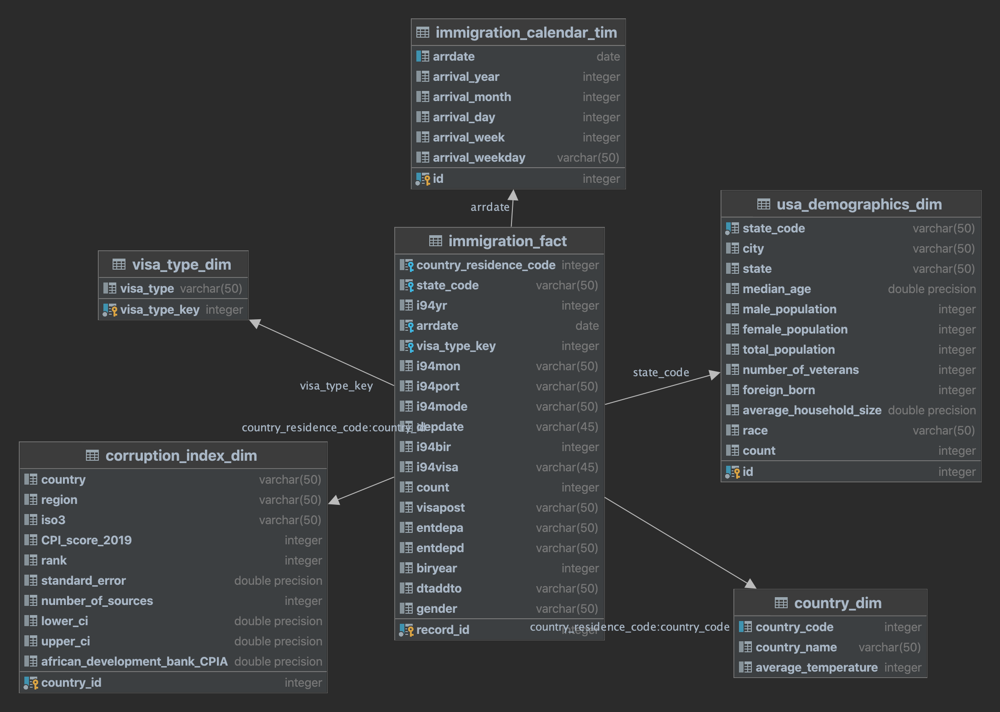

# Data Engineering Capstone Project

-----------------

## Project Summary
The goal of this project was to create ETL pipleine for immigration, temperature data, state and world corruption perceptions index data. We could try to find answears to questions such as, do people from countries with low or high CPI index immigrate to the US in large numbers, or do people from countries with warmer or cold climate immigrate to the US in large numbers?
## Data and code

-------------------
Prerequisites: AWS EMR cluster, Apache Spark, Python 3 All the data for this project was loaded into S3 before start the project, only is the i94_res.csv file which was loaded into Amazon EMR filesystem.

In addition to the data files, the project workspace includes:

- iam.cfg - contains configuration that allows the ETL pipeline to access AWS EMR cluster.
- Capstone_project_Happy.ipynb - jupyter notebook that was used for building the ETL pipeline.

### The project follows the follow steps:
- Step 1: Scope the Project and Gather Data
- Step 2: Explore and Assess the Data
- Step 3: Define the Data Model
- Step 4: Run ETL to Model the Data
- Step 5: Complete Project Write Up

## Step 1: Scope the Project and Gather Data

--------
### Project Scope

To create the database through the following steps:
- Use Spark to load the data into dataframes.
- Data analysis and data cleaning of I94 immigration dataset, temperature dataset, state and world CPI(Corruption Perceptions Index) data.
- Create immigration calendar dimension table from I94 immigration dataset and this table links to the fact table through the arrdate field.
- Create country dimension table from the I94 immigration dataset.
- Create country dimension table from the I94 immigration and the global temperatures dataset. The global land temperatures data was aggregated at country level. The table links to the fact table through the country of residence code allowing analysts to understand correlation between country of residence climate and immigration to US states.
- Create corruption dimension table from the CPI data and this table links to the fact table through the state code field.
- Create visa dimension table from the I94 immigration data and this table links to the fact table through the visa_type_key field.
- Create fact table from the clean I94 immigration dataset and the visa_type dimension.

## Step 2: Explore and Assess the Data

----
Explore, cleaning and data analysis is in to the jupyter notebook - Capstone_project_Corruption.ipynb

## Step 3: Define the Data Model

-----
### 3.1 Conceptual Data Model

In this project we have 5 dimensions table and 1 fact table. 
The usa demographics dimension table comes from `us-cities-demographics.csv` 
and link to fact table through the `state_code` field. 
The country dimension table is made up of data from the immigration datasets and link to fact table through the `country_code` field. 
The corruption index dimension table comes from the [corruption dataset](https://www.kaggle.com/datasets/jeegarmaru/corruption-perceptions-index-for-10-years?resource=download&select=CPI_2019_final_dataset.csv) 
and links to the immigration fact table through the `country_residence_code` field. 
The visa type dimension table comes from the immigration datasets and links to the immigaration through the visa_type_key field. 
The immigration fact table is the heart of the data model. 
This table's data comes from the immigration data sets and contains keys that links to the dimension tables.

### 3.2 Mapping Out Data Pipelines
The pipeline steps are as follows:
- Load the datasets
- Clean the I94 Immigration data to create Spark dataframe for each month
- Create visa_type dimension table
- Create calendar dimension table
- Create world corruption index table
- Extract clean global temperatures data
- Create country dimension table
- Create immigration fact table
- Load demographics data
- Clean demographics data
- Create demographic dimension table

## Step 4: Run Pipelines to Model the Data

-----------
### 4.1 Create the data model
Procedure, data dictionary and data checks in to the jupyter notebook - Capstone_project_Corruption.ipynb.

### 4.2 Data Quality Checks
Data count checks on fact and dimension table to be ensure that ETL procedure works fine.

### 4.3 Data dictionary
Data dictionary for new data model

## Step 5: Complete Project Write Up

------
- I use Apache Spark beacause it’s ability to handle multiple file formats with large amounts of data and it’s fast for big data and large dataset. Immigration data will be updated mounthly and other data yearly.
- Scenario
  - If the data was increased by 100x.
  Spark can handle the increase but we would consider increasing the number of nodes in our cluster.
  - The data populates a dashboard that must be updated on a daily basis by 7am every day.
In this scenario, Apache Airflow will be used to schedule and run data pipelines.
  - The database needed to be accessed by 100+ people.
We can use Amazon Redshift.
